# StoveIQ -- Open Source Smart Cooking Monitor

[](https://github.com/nickdnj/stoveiq/actions)
[](LICENSE-SOFTWARE)
[](LICENSE-HARDWARE)

An ESP32-S3 + MLX90640 thermal camera that turns any stove into a smart cooktop. Real-time heatmap, per-burner temperature tracking, thermal-aware recipe coaching, and cook session logging -- all running locally with zero cloud dependency.

**No cloud. No subscriptions. No app to install. Just open your browser.**

> **What am I looking at?** This started as a multipurpose kitchen gadget, became a
> commercial stove-safety product, got killed as a product, and came back as a personal
> build that lives over my own stove. That history explains most of the odd shapes in this
> repo -- see [Project History](#project-history). It is not a product, it is not for sale,
> and there is no roadmap to either.

> **Follow the build:** [YouTube Build Series](https://youtube.com/@vistter) | [Hackaday.io Build Log](https://hackaday.io/) *(project page coming soon)* | [GitHub Source](https://github.com/nickdnj/stoveiq)

## What it looks like

<table>
<tr>
<td width="33%">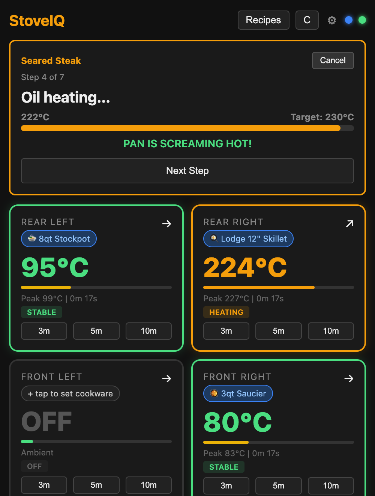</td>
<td width="33%">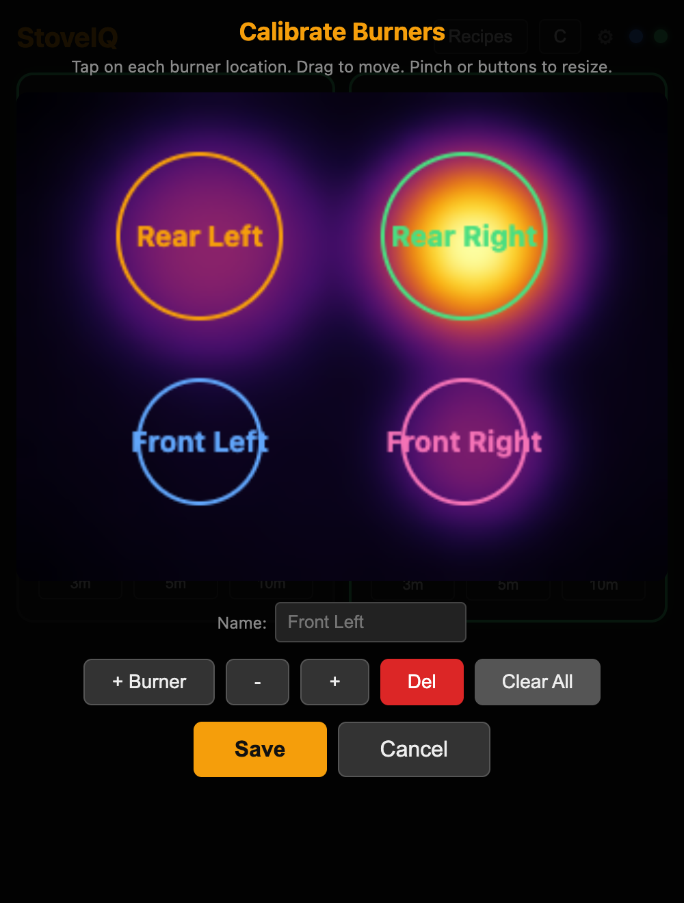</td>
<td width="33%">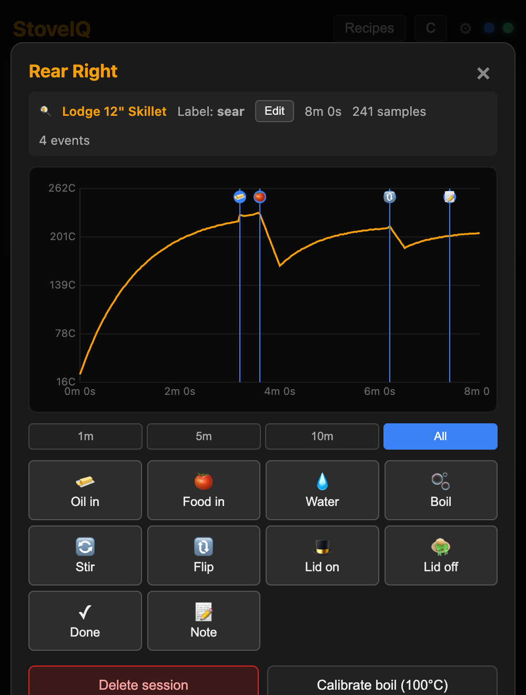</td>
</tr>
<tr>
<td><b>Recipe coaching.</b> Steps advance on thermal triggers, not timers. Live burner cards underneath.</td>
<td><b>Calibration.</b> The 768-pixel heatmap, bilinear-upscaled, with burner zones tapped onto it.</td>
<td><b>Teaching mode.</b> A finished sear, replayed. The dips are the steak going in and the flip.</td>
</tr>
<tr>
<td>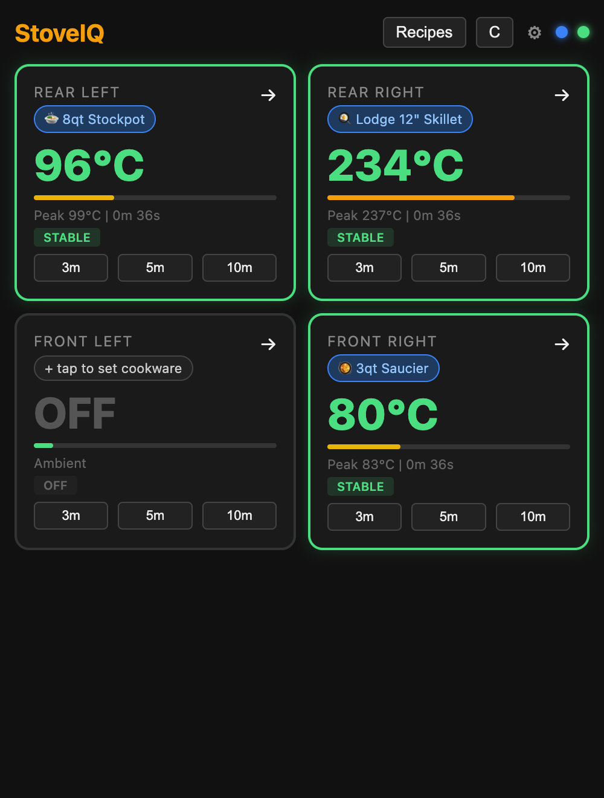</td>
<td>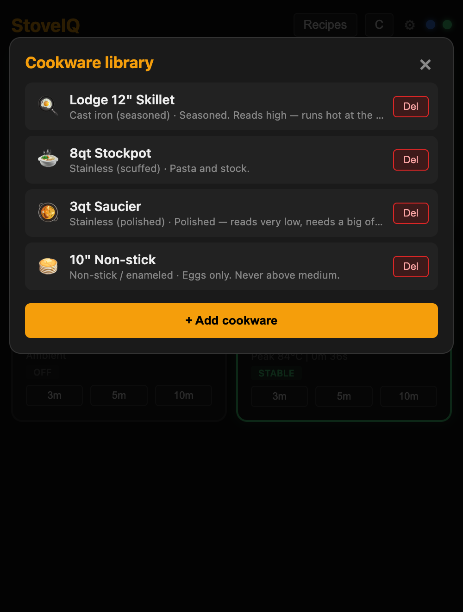</td>
<td>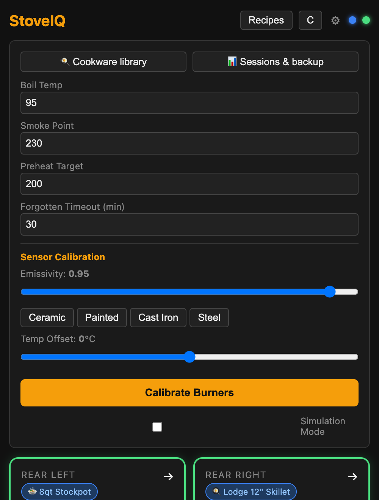</td>
</tr>
<tr>
<td><b>Dashboard.</b> Per-burner temperature, state, peak, and elapsed time.</td>
<td><b>Cookware library.</b> Emissivity is a property of the pot, so the pot is a first-class object.</td>
<td><b>Settings.</b> Alert thresholds and sensor calibration.</td>
</tr>
</table>

Real UI, synthetic thermal data — regenerate with
[`tools/ui-screenshots/`](tools/ui-screenshots/). Details and provenance in
[`docs/images/`](docs/images/).

## Features

- **Real-time thermal heatmap** -- 768-pixel IR view of your entire cooktop at 4Hz, bilinear-upscaled
- **Per-burner tracking** -- Auto-detects up to 4 burner zones with temperature, state, and trends
- **Recipe coaching** -- JSON state machines with thermal triggers (boil detected, pan preheated, oil in)
- **Cookware calibration** -- Emissivity is per-pot, not per-stove; calibration is a (burner x cookware) pair
- **Teaching mode** -- Tag what happened during a cook ("oil in", "rolling boil") and annotate the temp curve afterward
- **Smart alerts** -- Boil detection, oil smoke point warnings, pan preheated, forgotten burner
- **Runs as a PWA** -- HTTPS + Screen Wake Lock, so your phone stays awake on the counter while you cook
- **100% local** -- All processing on-device, data never leaves your kitchen
- **Works on any stove** -- Gas, electric coil, glass ceramic, induction

## Build Your Own

### Parts List (~$103 from Adafruit)

| Part | Price | Source |
|------|-------|--------|
| ESP32-S3-DevKitC-1-N8R8 | ~$16 | Adafruit (PID 5312) |
| MLX90640 IR Camera Breakout 110deg FoV | ~$75 | Adafruit (PID 4469) |
| Jumper wires (4x F-F) | ~$1 | Any supplier |
| USB-C cable + 5V adapter | ~$8 | Any supplier |
| 1.5" Schedule 40 PVC pipe (enclosure) | ~$3 | Hardware store |

MLX90640 modules run ~$25-35 on AliExpress, which brings the whole build closer to $50.

A custom PCB meant to replace the devkit lives in [`hardware/pcb/`](hardware/pcb/), but it
is a placement study rather than a board: it has no MCU on it, no routing, and 58 DRC
violations. Build the devkit version. See [Hardware](#hardware) below.

### Wiring

```
ESP32-S3 DevKit     MLX90640 Breakout
--------------      ----------------
3V3          -----> VIN
GND          -----> GND
GPIO 1 (SDA) -----> SDA
GPIO 2 (SCL) -----> SCL
```

### Flash Firmware

```bash
# Install PlatformIO
pip install platformio

# Clone and build
git clone https://github.com/nickdnj/stoveiq.git
cd stoveiq/firmware
pio run -e esp32s3 -t upload
```

The entire web UI is embedded in the firmware binary (`src/web_server.c`), so there is no
separate filesystem upload step. A SPIFFS partition exists and is mounted if populated,
but `firmware/data/` currently ships empty on purpose.

### Connect

1. Power on the device via USB-C
2. Connect to **StoveIQ** WiFi network (open, no password)
3. Open **https://192.168.4.1** in your browser
4. Accept the self-signed certificate warning (one time per device)
5. See your stove in thermal vision

To connect to your home WiFi (for access from any device):
- Use the **ESP BLE Prov** app (iOS/Android) with PoP: `stoveiq-setup`
- Or configure via the web UI settings page

Once on your network the device is reachable at **https://stoveiq.local** via mDNS. Port 80
stays up only to 301-redirect to HTTPS -- the Screen Wake Lock API that keeps your phone
awake while cooking requires a secure context, so plain HTTP is not an option.

## How It Works

```
MLX90640 IR Camera (24x32 pixels, 4Hz)
        |
        v
ESP32-S3 (FreeRTOS)
  Task 1: Sensor Read (Core 1)    -- I2C frame acquisition
  Task 2: Cooking Engine (Core 0) -- CCL burner detection + recipes + alerts
  Task 3: Web Server (Core 0)     -- HTTPS + WebSocket streaming
        |
        v
Browser (any device on WiFi)
  WebSocket binary frames --> Canvas 2D heatmap
  WebSocket JSON status   --> Per-burner dashboard
  localStorage            --> Cookware library, cook sessions, learned offsets
```

### Burner Detection

Connected Component Labeling (CCL) on thresholded thermal image:
1. Binary mask: pixels > ambient + 30C
2. Two-pass CCL with 8-connectivity
3. Filter noise (< 4 pixels) and spurious regions (> 200 pixels)
4. Rank by total heat, track centroids across frames
5. Classify state: OFF / HEATING / STABLE / COOLING via dT/dt

### Calibration

Calibration is two axes, not one:

- **Burner** -- a fixed spatial region of interest on the sensor. Set once by tapping the heatmap.
- **Cookware** -- a thermal property, picked per cook from a user-managed library.

The reason is emissivity: cast iron reads at ~0.95, polished stainless at ~0.05-0.16. A single
global emissivity value is wrong for nearly every pot on the stove. Offsets are stored per
(burner x cookware) pair and applied at display time only -- sessions keep raw temperatures so
the data stays reinterpretable. See [`docs/phase1-cookware-teaching.md`](docs/phase1-cookware-teaching.md).

---

## Hardware

All of it drawn in free and open-source tools -- KiCad for the board, OpenSCAD for the
enclosure. Every image below is generated from source by
[`hardware/render.sh`](hardware/render.sh), not exported by hand.

### Enclosure -- built, and holding the thing up right now

1.5" Schedule 40 PVC pipe split lengthwise. The lower half holds the MLX90640 behind a
14mm window, the upper half holds the devkit, zip ties clamp them together, and the tube
rotates inside a printed cradle so you can aim it and lock the angle.

| Assembled tube | Cabinet bracket | Sensor half |
|---|---|---|
| 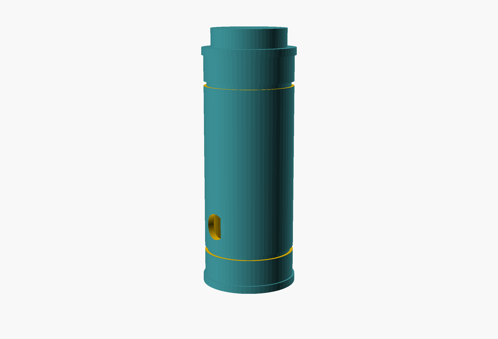 | 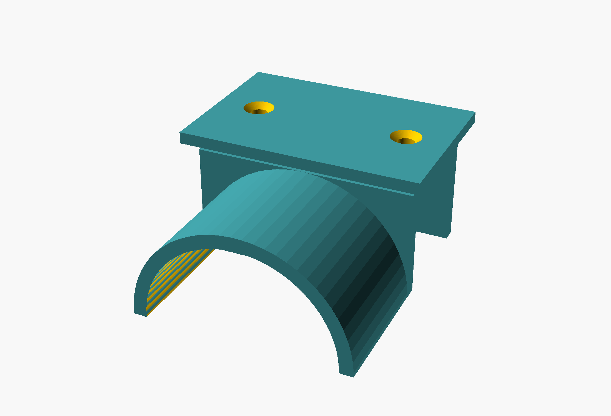 | 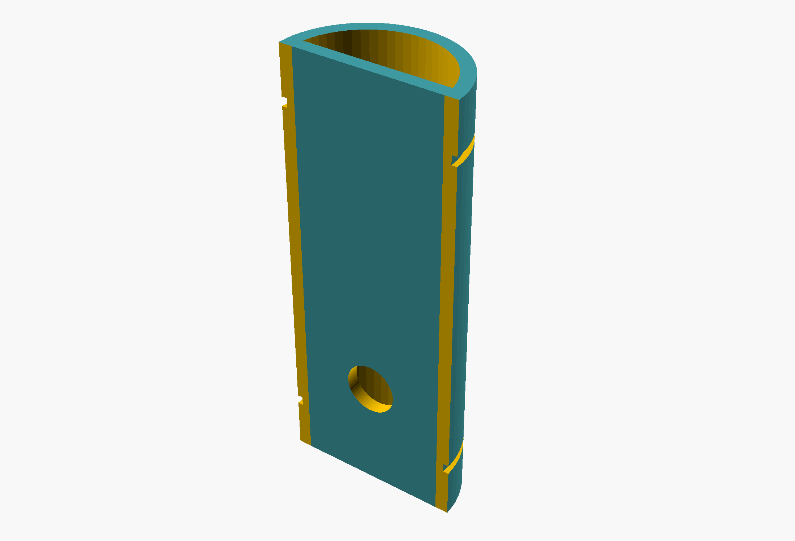 |

Parametric, so you can re-cut it for your own cabinet before printing. Build guide:
[`docs/enclosure-build.md`](docs/enclosure-build.md) · Models and dimensions:
[`hardware/enclosure/`](hardware/enclosure/)

### Custom PCB -- drawn, not finished

A 45x35mm two-layer board to replace the devkit and breakout with one assembly.

| Schematic | 3D | Top copper |
|---|---|---|
| 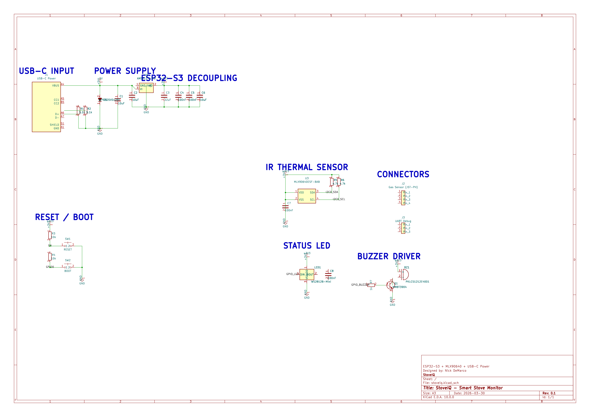 | 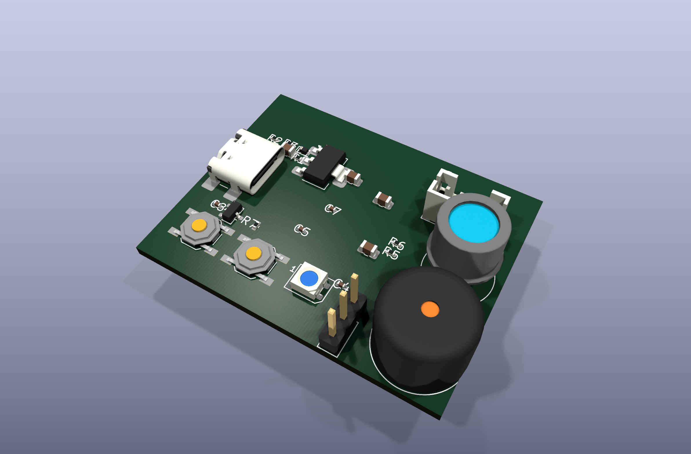 | 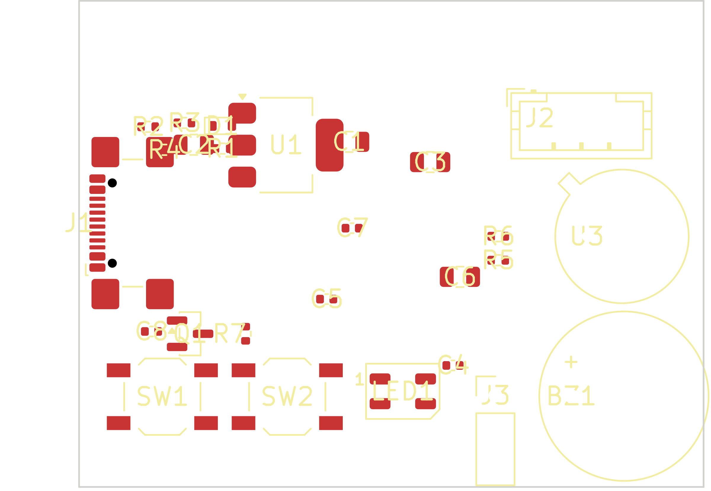 |

That third image is the honest one: **there is not a single trace on this board.** The
support circuitry is captured -- USB-C input, 3.3V regulation, the thermal sensor, an RGB
status LED, a piezo buzzer, reset and boot buttons -- but the ESP32-S3 module was never
placed, so every GPIO net dangles, and nothing is routed.

| | |
|---|---|
| Schematic capture | Partial -- everything except the MCU |
| Routing | None. 0 tracks, 0 vias |
| DRC | 58 violations, including 2 shorts |
| Fabricated | Never |

Full accounting, BOM, and known issues: [`hardware/pcb/README.md`](hardware/pcb/README.md).
If you want to finish it, the files are all here and the licence is permissive.

### Built with

| Tool | Licence | Used for |
|---|---|---|
| [KiCad](https://www.kicad.org/) 10 | GPL-3.0 | Schematic, layout, 3D raytracing, DRC, fab output |
| [OpenSCAD](https://openscad.org/) | GPL-2.0 | Parametric enclosure modelling |
| [FreeCAD](https://www.freecad.org/) | LGPL-2.1 | Alternative enclosure macro |
| [Freerouting](https://freerouting.org/) | AGPL-3.0 | Autorouting attempt |
| [PlatformIO](https://platformio.org/) + [ESP-IDF](https://github.com/espressif/esp-idf) | Apache-2.0 | Firmware build |
| [librsvg](https://gitlab.gnome.org/GNOME/librsvg) | LGPL-2.1 | SVG to PNG for these images |

```bash
brew install kicad openscad librsvg   # or: apt install kicad openscad librsvg2-bin
hardware/render.sh
```

---

## Project History

Worth reading if you are trying to understand why an open-source hobby repo contains a
provisional patent's worth of thermal research, a Kickstarter-grade BOM, and a KiCad board
nobody fabricated. The short version: this project was three different things in four weeks.

| When | What it was |
|---|---|
| Mar 25, 2026 | A multipurpose kitchen gadget idea |
| Mar 26-27, 2026 | A commercial product, then narrowed to a safety-only device |
| Mar 28 - Apr 4, 2026 | A built safety product: firmware, Flutter app, cloud, CI |
| Apr 7, 2026 | Killed -- the commercial case did not survive research |
| Apr 9, 2026 onward | This repo: the original idea, built for one kitchen, in the open |

### 1. The multipurpose version

The first note described a thermal sensor under the range hood doing everything at once:
live heatmap, per-burner temperatures, boil detection, "did I leave the stove on" alerts,
oven monitoring, gas leak sensing, historical usage, a voice assistant hook. It was a
weekend-project wishlist, not a product. The only real constraint was the sensor -- the
MLX90640 was the cheapest array that reads to 300C, which is what ruled out the AMG8833
and set the whole hardware stack.

### 2. It turned into a product

Within a day it grew a full product-development package: PRD, architecture spec, UX spec,
sensor validation study, provisional patent draft, a BOM costed at 100 and 1,000 units
(~$25-37 landed), $199-229 MSRP, and a Kickstarter strategy benchmarked against Inirv
React's $176K raise. Cooking a thing for yourself had become launching a thing at people.

### 3. GStack narrowed it to a safety device

I ran the plan through GStack reviews -- an AI review pipeline (`/office-hours`,
`/plan-ceo-review`) that interrogates a plan the way a skeptical founder or investor would.
The verdict was uncomfortable and correct:

- **The buyer is not the cook.** Safety drives the purchase decision; cooking features drive
  daily engagement. The primary user is the adult child of a parent living alone, not me.
- **The MVP was still too broad.** It got stripped to a single question: *"Is Mom's stove on?"*
  Whole-frame max temperature, a duration timer, a push notification, a buzzer. That was all.
- **Everything I actually wanted got deferred.** Heatmap, per-burner detection, boil detection,
  calibration wizard, cooking history -- all pushed to "v2."

Fair review, honestly followed. Over the next week I built exactly that: safety-monitor
firmware, a Flutter app, Firebase push, MQTT, OTA updates, golden-vector tests, a security
review pass, CI. It lives in an archived private repo. None of it is in this one.

### 4. GStack then killed the product

A patent and competitive research pass on April 7 turned up
[Pippa Technologies](https://www.mypippa.me/) -- a UK company with **EP3908785B1**, granted
February 2025, covering IR thermal imaging for cooking appliance monitoring. Dragons' Den
funded, shipping at GBP 179.99 plus a subscription, on Amazon UK, with a US expansion in
progress. Meanwhile Cooksy, the closest thermal-cooking product, appeared to be retreating
from its $299-699 cooking-only position.

Add the rest of the arithmetic for a solo builder: FCC plus likely UL certification, and
open-ended liability for a device whose entire promise is *"we will warn you before the fire."*
The commercial case did not hold.

*None of that is a legal conclusion.* No freedom-to-operate opinion was ever commissioned.
It was a judgment call -- the kind where you do not want to find out the hard way.

I then researched seven other markets for the identical hardware stack: electrical panel
thermal monitoring (the best-graded of them, with a proven insurance distribution channel),
3D printer fire detection, dryer lint fires, EV charging, solar hotspots, beehives, server
rooms. All of them were more viable than the stove. I did not chase any of them, because
none of them were the thing I wanted in my kitchen.

### 5. Pivot back to just... my stove

On April 9 the project restarted as what it had been on day one, minus the ambition.

**Dropped:** company, Kickstarter, patent, cloud, MQTT, Flutter app, app store,
subscription, caregiver dashboard, and every safety claim.

**Kept:** the hardware, and the thing I actually wanted.

A fresh public repo was necessary anyway -- the old one had WiFi and MQTT credentials
committed in its history -- so it was archived private and this one started clean. The
happy accident: every cooking feature GStack had correctly cut as "v2 nice-to-have" became
the entire point again, because there was no longer a product for them to be a distraction
from.

That is why this repo is local-first, ships no cloud, makes no safety promises, and serves
its UI off an ESP32 instead of an app store.

### 6. Where it is now

Mounted over my stove and used for real cooking. Since the pivot it has grown recipe state
machines, HTTPS so the phone's wake lock works, cookware-based calibration, and a teaching
mode that captures labeled cook sessions -- a corpus for phase-aware calibration later. The
KiCad board and enclosure models landed in August 2026. The enclosure is printed and in
use; the board never got past component placement and has never been fabricated.

### Does it have economic value?

Honest answer: no idea, and I stopped trying to find out -- which was the point of stopping.

What I do know: as a commercial *safety* device the path is blocked, expensive, and legally
exposed for one person. As a *cooking* product the nearest comparable retreated from that
price point. As a personal build it has been worth every hour.

The software is MIT and the hardware is CERN-OHL-S-2.0. If you see the market I could not,
the files are all here -- schematics, board, enclosure, firmware, recipes. Take it.

---

## Repo Structure

```
stoveiq/
  firmware/
    src/              # Firmware source (C, ESP-IDF) -- web UI embedded in web_server.c
    include/          # Shared headers
    test/             # Unity test suite
    emulator/         # Desktop thermal emulator + scenarios
    lib/MLX90640/     # Melexis sensor driver
  hardware/
    render.sh         # Regenerates every hardware image from source
    pcb/              # KiCad 10 project -- schematic, layout, fab outputs
      renders/        #   Generated: schematic, layer plots, 3D views
    enclosure/        # PVC tube + wedge box (OpenSCAD, FreeCAD macro)
      renders/        #   Generated: assembly, parts, bracket
  enclosure/          # Byte-identical copy of hardware/enclosure/stoveiq_enclosure.scad,
                      # kept so the old path still resolves
  tools/
    ui-screenshots/   # Runs the web UI on a desktop with synthetic thermal data
  recipes/            # Community recipe JSON state machines + schema
  docs/
    images/           # UI screenshots used on this page
  video/              # Build-series script, storyboard, assembly pipeline
```

Enclosure files are OpenSCAD/FreeCAD sources, not pre-sliced STLs -- render your own.

## Development

### Desktop Emulator

Build and run without hardware using the thermal scene emulator:

```bash
cd firmware
pio run -e emulator
.pio/build/emulator/program
```

### Run Tests

```bash
cd firmware
pio test -e emulator
```

> **Currently broken.** `test/test_integration.c` includes `safety_monitor.h`, a header
> from the archived safety-product build that was never carried into this repo, so the
> test binary fails to compile and takes the other two suites down with it. Deleting that
> one file gets `test_sensor.c` and `test_cooking_engine.c` running again.

### See the web UI without hardware

The interface is embedded in the firmware as a C string, and the emulator build excludes
`web_server.c` -- so there is normally no way to look at the UI without flashing a board.
[`tools/ui-screenshots/`](tools/ui-screenshots/) extracts it and serves it locally against
a synthetic thermal feed that speaks the firmware's real WebSocket protocol.

```bash
cd tools/ui-screenshots
pip install aiohttp
python3 extract.py && python3 server.py --recipe   # http://127.0.0.1:8770
```

## Contributing

Contributions welcome -- especially:
- Recipes (see [`recipes/README.md`](recipes/README.md) for the schema and PR template)
- Web UI improvements (`firmware/src/web_server.c`)
- New cooking alert types
- Enclosure variants for different mounting scenarios
- Translations

Bear in mind what this project is: a personal build shared in the open. Issues and PRs get
looked at when there is time, and "does this make it better in my kitchen?" is a legitimate
review criterion.

## License

- **Software:** [MIT](LICENSE-SOFTWARE)
- **Hardware:** [CERN-OHL-S-2.0](LICENSE-HARDWARE)

## Inspired By

- [Combustion Inc](https://combustion.inc/) -- Smart cooking thermometer with predictive algorithms (internal meat temps via probe). StoveIQ provides the complementary view: surface thermal imaging of the entire cooktop from above.

---

## Follow the Project

| Platform | Link | What You'll Find |
|----------|------|-----------------|
| **GitHub** | [nickdnj/stoveiq](https://github.com/nickdnj/stoveiq) | Source code, hardware files, issues |
| **YouTube** | [@vistter](https://youtube.com/@vistter) | Build videos, cooking demos, deep dives |
| **Hackaday.io** | *(coming soon)* | Build log, community discussion |

**Planned video series:**
1. "I Built a $100 Thermal Cooking Coach (and it actually works)" -- launch overview + demo
2. "Real-Time Thermal Imaging with ESP32" -- WebSocket streaming deep dive
3. "Can an IR Camera Detect When Water Boils?" -- cooking science + algorithm
4. "3D Printing a Parametric Enclosure in OpenSCAD" -- design + print process
