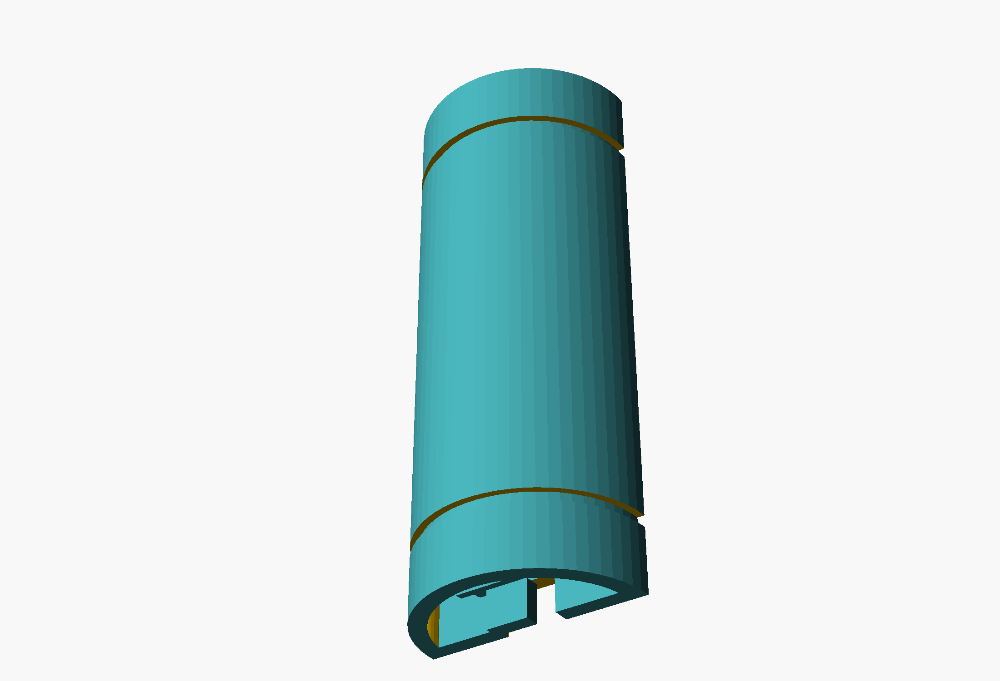
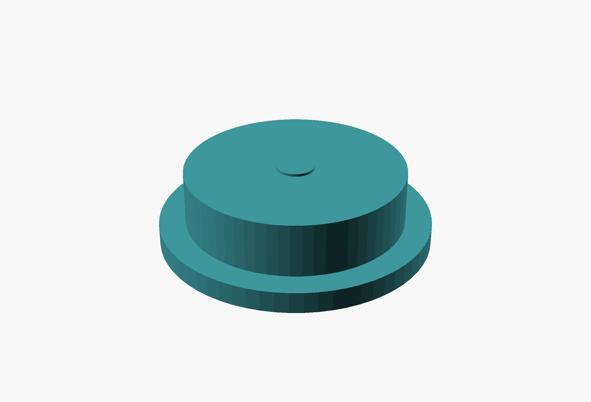
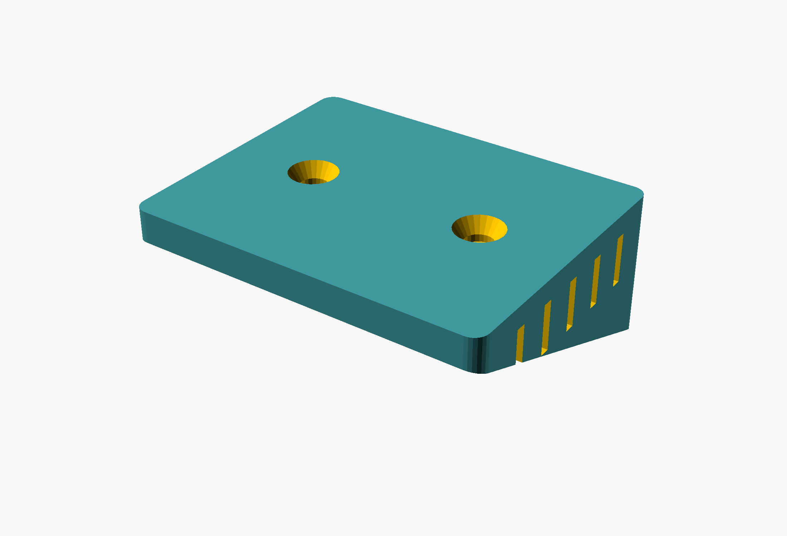
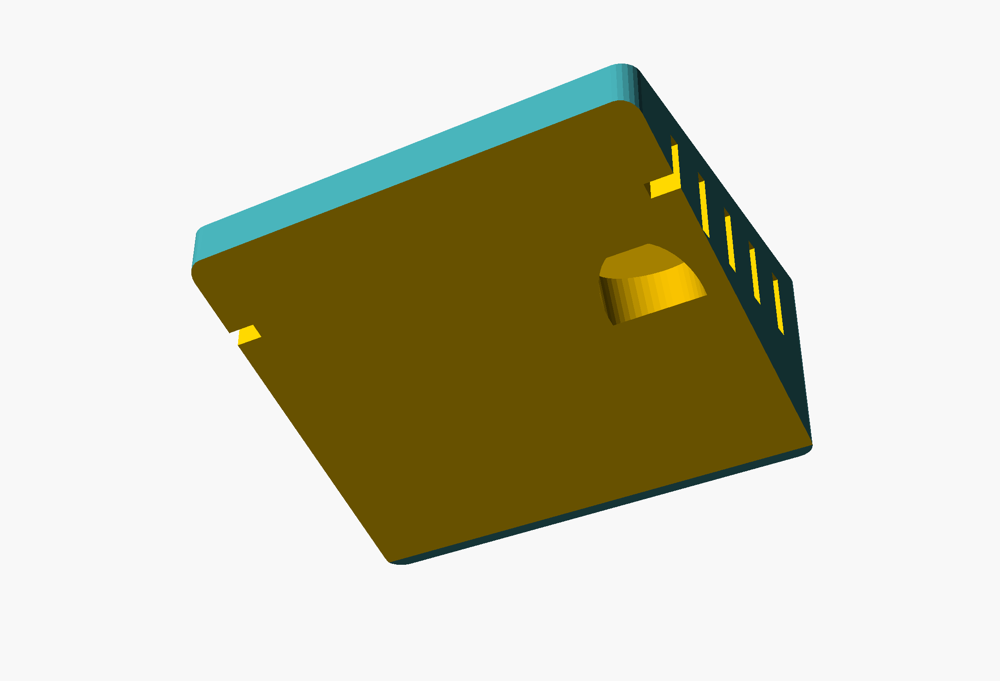
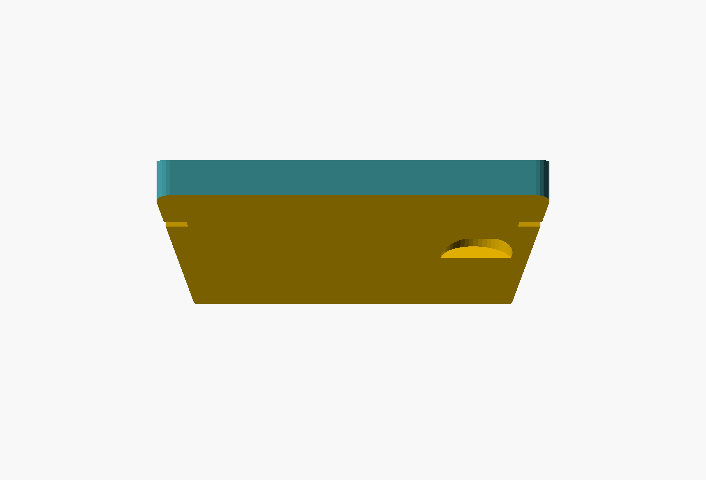

# StoveIQ Enclosures

Two parametric enclosure designs, both written in **OpenSCAD** — free software,
plain text, diffable. Neither ships as a pre-sliced STL: render your own from
source so you can change the dimensions for your cabinet first.

| | Design | For | Status |
|---|---|---|---|
| **A** | [PVC split-tube](#a--pvc-split-tube) | ESP32-S3 devkit + MLX90640 breakout | Built and mounted; the documented build |
| **B** | [Wedge box](#b--wedge-box) | The custom [PCB](../pcb/) | Modelled only — the board it houses is unfinished |

Design A is what you want if you are following the parts list in the root
README. Design B exists for the custom board and cannot be used until that board
does.

---

## A — PVC split-tube

1.5″ Schedule 40 PVC pipe, split lengthwise into two D-shaped halves. The lower
half carries the MLX90640 and its 14 mm camera window; the upper half carries the
ESP32-S3 devkit and the USB-C exit notch. Zip ties through the outer-diameter
grooves clamp the halves together, and the finished tube drops into a printed
cradle that screws to the underside of a cabinet. Rotate the tube in the cradle
to aim at the stove, then tighten.

The circular cross-section is the whole point: aiming is a rotation, and a
rotation is trivial to lock.

**Source:** [`stoveiq_pvc_enclosure.scad`](stoveiq_pvc_enclosure.scad) ·
**Build guide:** [`../../docs/enclosure-build.md`](../../docs/enclosure-build.md)

| Assembled | Mounting bracket |
|---|---|
|  |  |
| Both halves mated, end caps fitted. The 14 mm camera window and the two zip-tie grooves are visible. | Screws to the cabinet underside on 40 mm centres; the tube rotates inside the cradle to aim. |

| Sensor half | ESP32 half | End cap |
|---|---|---|
|  |  |  |
| Camera window plus four M2 standoffs for the breakout. | USB-C exit notch and alignment tabs. | Press-fit spigot, optionally vented. |

### Key dimensions

| Parameter | Value | Note |
|---|---|---|
| `PIPE_OD` / `PIPE_ID` | 48.26 / 40.89 mm | 1.5″ Sch 40, so real pipe interchanges with printed halves |
| `PIPE_L` | 120 mm | Cut length |
| `WALL` | 3.685 mm | Matches the real PVC wall |
| `WIN_D` | 14 mm | Camera window — clears the 110° field of view |
| `WIN_Z` | 30 mm | Window position from the sensor end |
| `GROOVE_Z1` / `Z2` | 15 / 105 mm | Zip-tie grooves |
| `TAB_Z1` / `Z2` | 20 / 100 mm | Alignment tabs, 0.3 mm clearance |
| `BKT_HOLE_SP` | 40 mm | Bracket screw spacing, #8 or M4 |

### Two ways to build it

- **Fully printed** — print both halves in PETG or ASA. No pipe needed.
- **Hybrid** — buy 6″ of real 1.5″ PVC, cut it in half lengthwise with a
  hacksaw, and print only the end caps and the bracket. Cheaper and stiffer.

**Print settings:** 0.2 mm layers, 35 % gyroid infill, 3 perimeters, no supports
— every surface is designed to print face-down without them. PETG indoors, ASA
if it will see heat or sun.

---

## B — Wedge box

A closed box for the custom PCB. The top face is flat and screws to the cabinet;
the bottom face tilts 35° so the sensor looks down and forward at the cooktop
without the whole box needing to be angled. Side vents let convected heat out.

**Source:** [`stoveiq_enclosure.scad`](stoveiq_enclosure.scad)

| Isometric | Underside | Side profile |
|---|---|---|
|  |  |  |
| Flat cabinet face with two countersunk mounting holes. | The 35° face carrying the 10 mm IR aperture, plus side vents. | The wedge taper. |

### Key dimensions

| Parameter | Value | Note |
|---|---|---|
| `pcb_w` × `pcb_d` | 45 × 35 mm | Matches the [PCB](../pcb/) outline |
| `sensor_angle` | 35° | Camera tilt from vertical |
| `ir_aperture` | 10 mm | Wider than the TO-39 can, for FoV margin |
| `wall` | 2.0 mm | Shell thickness |
| `gap` | 0.5 mm | PCB clearance all round |
| `standoff_h` | 3 mm | Board height above the floor |

Outer size and wedge heights are derived from these — OpenSCAD `echo`es them at
render time.

> This design targets a board that has no MCU and no routing. Treat it as a
> volume study until [`../pcb/`](../pcb/) is finished.

---

## Rendering and printing

```bash
# Regenerate every image above
hardware/render.sh

# Export a printable STL (pick the part you want)
openscad -o sensor_half.stl -D SHOW_ASSEMBLY=false -D SHOW_SENSOR_HALF=true \
         stoveiq_pvc_enclosure.scad
openscad -o bracket.stl     -D SHOW_ASSEMBLY=false -D SHOW_SENSOR_HALF=false \
         -D SHOW_BRACKET=true stoveiq_pvc_enclosure.scad

# Or open it and use the GUI
openscad stoveiq_pvc_enclosure.scad
```

Render flags for the PVC design: `SHOW_SENSOR_HALF`, `SHOW_ESP32_HALF`,
`SHOW_END_CAP`, `SHOW_BRACKET`, `SHOW_ASSEMBLY`, `SHOW_COMPONENTS` (ghost PCBs
for clearance checking). The wedge design takes no flags — it renders the whole
box.

### A note on `stoveiq_pvc_enclosure.FCMacro`

A FreeCAD macro that builds the same tube. It has not been kept in step with the
`.scad`, which is the source of truth for the renders above.

---

## Licence

Hardware in this directory is [CERN-OHL-S-2.0](../../LICENSE-HARDWARE).
