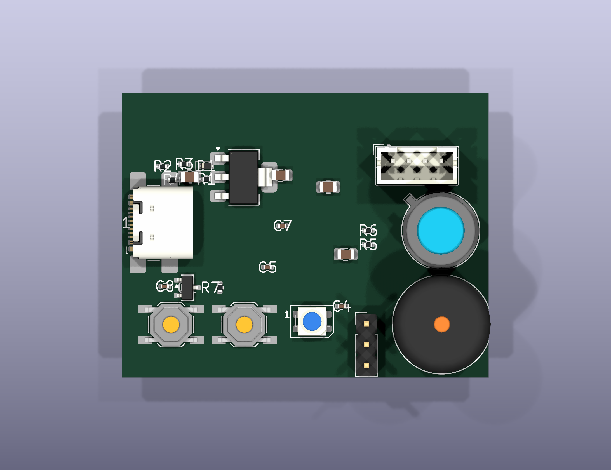
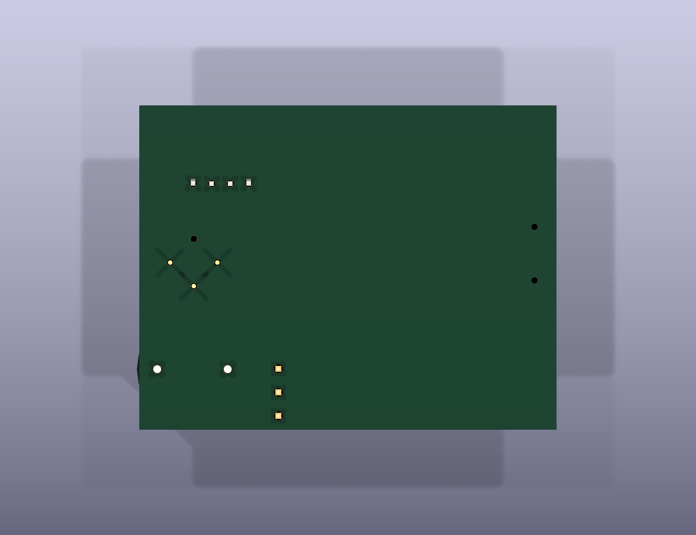
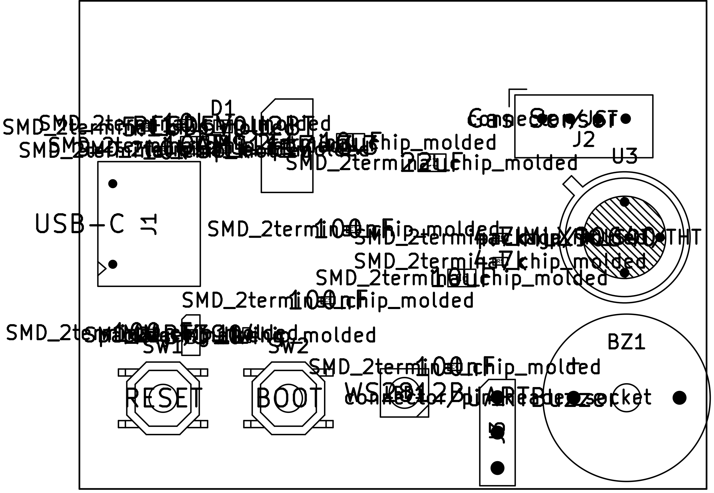

# StoveIQ PCB

A 45 × 35 mm two-layer board that replaces the ESP32-S3 devkit and the MLX90640
breakout with a single assembly. Drawn in **KiCad 10**, entirely with free and
open-source tools.

> ### Status: placement study, not a fabricable board
>
> Read this before you send anything to a fab house. The support circuitry is
> captured and the parts are placed, but the board is **not finished**:
>
> | | |
> |---|---|
> | Schematic capture | Partial — power, USB-C, sensor, LED, buzzer, buttons |
> | **MCU** | **Absent.** There is no `U2`. See [below](#the-missing-mcu). |
> | Routing | **None.** 0 track segments, 0 vias. 13 copper zones only. |
> | DRC | **58 violations**, including 2 hard shorts |
> | Fabricated | Never |
>
> Everything below documents what is genuinely in the files. Nothing here has
> been built, and the board as committed would not work if it were.

---

## What it looks like

| Schematic |
|---|
| [](renders/schematic.pdf) |
| Power in, regulation, sensor, indicators. Click through for the PDF. Note there is no MCU sheet — that is the gap described below. |

| 3D — isometric | Top | Bottom |
|---|---|---|
|  |  |  |

| Copper + silkscreen (top) | Assembly drawing |
|---|---|
|  |  |

The top-layer plot is the honest one: **there is not a single trace on it.**
Every pad is an island. The large empty region on the left is where the MCU
would go if it existed, and the colliding designators around `R1`–`R4` are the
`silk_overlap` DRC violations.

Regenerate all of these with [`../render.sh`](../render.sh).

---

## The missing MCU

The schematic contains `U1` (the LDO) and `U3` (the thermal sensor). It does not
contain `U2`. An earlier version of this file documented `U2` as an
`ESP32-S3-WROOM-1-N8R8`; that row described a part that was never placed, and it
has been removed from the bill of materials below.

The practical consequence is that these nets are driven by nothing:

| Net | Should connect to | Currently |
|---|---|---|
| `I2C0_SDA` / `I2C0_SCL` | ESP32-S3 GPIO 1 / 2 | Sensor + pull-ups only, no master |
| `GPIO_LED` | ESP32-S3 GPIO 38 | WS2812B data-in, floating |
| `GPIO_BUZZER` | ESP32-S3 GPIO 39 | Q1 base resistor, floating |
| `EN` | ESP32-S3 enable | Pull-up + reset button, floating |
| `GPIO0` | ESP32-S3 boot select | Pull-up + boot button, floating |
| `USB D+` / `D-` | ESP32-S3 GPIO 20 / 19 | USB-C connector, unrouted |

Finishing the board means adding the module symbol and footprint, wiring those
nets, resolving the shorts, and routing. That work has not been done.

---

## Bill of materials

As captured in `stoveiq.kicad_sch`. Reference designators match the schematic and
the assembly drawing above.

| Ref | Part | Package | Purpose |
|-----|------|---------|---------|
| U1 | AMS1117-3.3 | SOT-223 | 5 V → 3.3 V LDO regulator |
| U3 | MLX90640ESF-BAB | TO-39, 4-lead | 32 × 24 IR thermal array, 110° FoV |
| J1 | GCT USB4110-GF-A | SMD | USB-C receptacle, power input |
| J2 | B4B-PH-K-S | JST-PH 1×4 | Gas sensor expansion (I²C bus 1) |
| J3 | Pin header 1×3 | 2.54 mm | UART debug (omit in production) |
| LED1 | WS2812B-Mini | PLCC4 | RGB status LED |
| BZ1 | PKLCS1212E4001 | 12 mm | Piezo buzzer |
| Q1 | MMBT3904 | SOT-23 | Buzzer NPN driver |
| D1 | PESD5V0U2BT | SOD-523 | USB ESD protection |
| SW1 / SW2 | Tactile switch | 6 mm | Reset / boot mode |
| R1–R2 | 5.1 kΩ | 0402 | USB-C CC pull-downs |
| R3–R4 | 10 kΩ | 0402 | EN / GPIO0 pull-ups |
| R5–R6 | 4.7 kΩ | 0402 | I²C pull-ups (bus 0) |
| R7 | 1 kΩ | 0402 | Buzzer base resistor |
| C1–C2 | 10 µF / 10 V | 0805 | Input + LDO input caps |
| C3 | 22 µF / 6.3 V | 0805 | LDO output cap |
| C4–C5 | 100 nF | 0402 | MCU decoupling (for the absent U2) |
| C6 | 10 µF | 0805 | Bulk decoupling |
| C7–C8 | 100 nF | 0402 | MLX90640 + LED decoupling |

**Not in the BOM, but required for a working board:** an
ESP32-S3-WROOM-1-N8R8 module and its antenna keep-out.

### Intended ESP32-S3 pin assignment

Carried over from the devkit build in `firmware/`, kept here as the target for
whoever wires up the MCU. These match the pins the firmware actually uses.

| GPIO | Function |
|------|----------|
| 1 / 2 | I²C0 SDA / SCL — MLX90640 |
| 3 / 4 | I²C1 SDA / SCL — gas sensor expansion (J2) |
| 19 / 20 | USB D− / D+ — native USB-JTAG |
| 38 | WS2812B data |
| 39 | Buzzer, via Q1 |
| 43 / 44 | UART0 TX / RX — debug header (J3) |
| 0 | Boot select (SW2) |
| EN | Reset (SW1) |

---

## Known issues

Reproduce with `kicad-cli pcb drc stoveiq.kicad_pcb`. The report in
[`stoveiq-drc.rpt`](stoveiq-drc.rpt) was generated 2026-03-30.

**Shorts (2)** — these are electrical faults, not cosmetic:

- `EN` shorted to `GPIO0` across the SW1 / SW2 pads. Holding reset would also
  pull the chip into download mode.
- `+3V3` shorted to U1's GND/Adj pad — the regulator output tied to its own
  ground reference.

**Clearance and mask (21)** — 9 clearance violations down to 0.00 mm (J1's own
pads overlap D1's), 8 solder-mask bridges, 4 copper-to-edge violations.

**Silkscreen (26)** — designators overlapping pads and each other, and running
off the board edge. Visible in the top-layer plot above.

**Courtyards (9)** — U3 overlaps J2, and BZ1 overlaps U3. The parts physically
collide at the right-hand edge; you can see it in the isometric render.

**Unconnected (6)** — the dangling MCU nets listed earlier.

### Two 3D models are substituted for rendering

KiCad 10 ships these footprints but not their STEP files, so the board rendered
with bare pads until they were repointed. This affects the *pictures only* — the
footprints, pads, and BOM are unchanged.

| Footprint | Missing model | Substituted with |
|---|---|---|
| `USB_C_Receptacle_GCT_USB4110` | `USB_C_Receptacle_GCT_USB4110.step` | `USB_C_Receptacle_GCT_USB4105-xx-A_16P_TopMnt_Horizontal.step` — same GCT 16-pin top-mount family |
| `TO-39-4_Window` | `TO-39-4_Window.step` | `TO-39-3_Window.step` — identical can and window, one fewer lead |

---

## Working with the files

```bash
# Open in KiCad
kicad hardware/pcb/stoveiq.kicad_pro

# Re-run design rule check
cd hardware/pcb && kicad-cli pcb drc stoveiq.kicad_pcb

# Regenerate every image in renders/
hardware/render.sh
```

`stoveiq.dsn` and `stoveiq.ses` are a [Freerouting](https://freerouting.org/)
round-trip from March 2026. The `.ses` was exported but never imported back into
the board, which is why the layout still has no tracks.

`stoveiq_test.kicad_pcb` / `.kicad_pro` are a scratch project, not part of the
design.

### Altium import

KiCad projects import directly: **File → Import → KiCad Design Files**, then
select `stoveiq.kicad_pro`. Given the state of the board, you would be importing
a placement, not a layout.

---

## Licence

Hardware in this directory is [CERN-OHL-S-2.0](../../LICENSE-HARDWARE).
